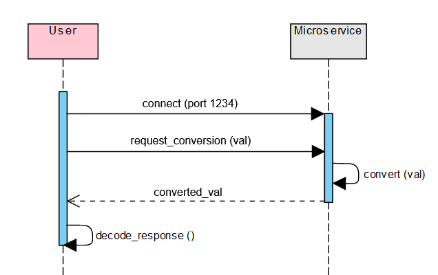

# Communication Contract

## Requesting Data

1. Import the needed modules.

```
import socket, json
```

2. Connect to the microservice using a socket. Here we are assuming that the microservice is running on the client's computer on port 1234.

```
s = socket.socket(socket.AF_INET, socket.SOCK_STREAM)
s.connect((socket.gethostname(), 1234))
```

3. Create your request object and convert it to json format. The object needs to include the temperature value to be converted, the unit it is being converted from, and the unit it is being converted to. In the example below the temperature is being converted from Kelvin units into Celsius.

```
req = {"val": 300, "conv_from": "k", "conv_to": "c"}
req_json = json.dumps(req)
```

4. Send the created json request through the socket connection created.

```
s.send(bytes(req_json, "utf-8"))
```

**_Note:_** The connection to the microservice is closed following the request. To make a new request you must always connect to the microservice first.

## Receive Data

After sending your request await a response from the microservice using `recv` and then decode the received response.

```
response = s.recv(2048).decode()
```

## UML Sequence Diagram


